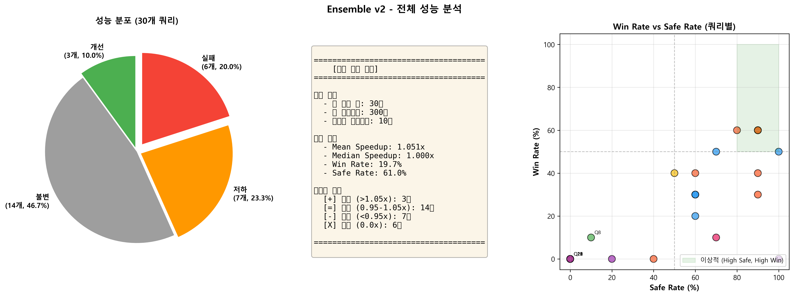
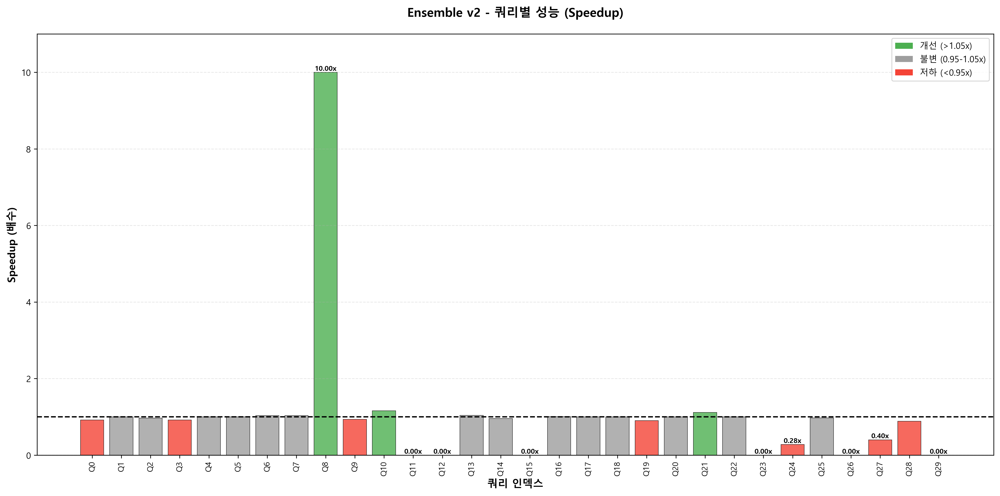
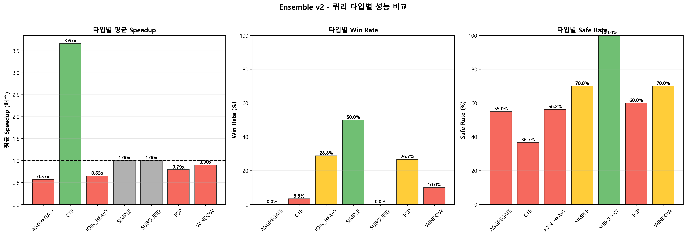

# Ensemble v2 최종 평가 보고서

**생성일**: 2025-10-30  
**평가 대상**: Ensemble v2 (4-Model Ensemble: DQN v4, PPO v3, DDPG v1, SAC v1)  
**평가 규모**: 30 쿼리 × 10 에피소드 = 300회  
**투표 전략**: Majority Voting  

---

## 📋 **목차**

1. [전체 요약](#1-전체-요약)
2. [주요 개선사항 (v1 → v2)](#2-주요-개선사항-v1--v2)
3. [성능 메트릭](#3-성능-메트릭)
4. [쿼리별 상세 결과](#4-쿼리별-상세-결과)
5. [쿼리 타입별 분석](#5-쿼리-타입별-분석)
6. [액션 효과성 분석](#6-액션-효과성-분석)
7. [주요 발견사항](#7-주요-발견사항)
8. [문제점 및 해결 과제](#8-문제점-및-해결-과제)
9. [결론](#9-결론)

---

## 1. 전체 요약

### 1.1 핵심 성능 지표

| 지표 | 값 | 평가 |
|------|-----|------|
| **Mean Speedup** | **1.051x** | 5% 개선 |
| **Median Speedup** | **1.000x** | 중간값은 변화 없음 |
| **Win Rate** | **19.7%** | 약 1/5 쿼리에서 개선 |
| **Safe Rate** | **61.0%** | 과반수에서 안전 |
| **Total Episodes** | **300회** | 30 쿼리 × 10 에피소드 |

### 1.2 평가 요약

**긍정적 측면:**
- ✅ DDPG v1, SAC v1 모델 활성화 성공 (v1에서는 완전히 비활성화)
- ✅ PPO v3 액션 매핑 구현으로 44→19 액션 변환 성공
- ✅ `OPTION (RECOMPILE)` 적용으로 쿼리 캐시 이슈 해결
- ✅ 일부 쿼리에서 의미있는 성능 개선 (Query 10: 1.161x, Query 21: 1.117x)

**부정적 측면:**
- ❌ 전체적으로 낮은 Win Rate (19.7%)
- ❌ TOP, JOIN_HEAVY 쿼리에서 성능 저하 (v1에서 목표로 했던 영역)
- ❌ 20% 쿼리에서 실행 실패 (0ms 반환): Query 11, 12, 15, 23, 26, 29
- ❌ 일부 쿼리에서 심각한 성능 저하 (Query 24: 0.277x, Query 27: 0.400x)

### 1.3 시각화 요약

#### 전체 성능 분포


*그림 1: 전체 성능 분포 (파이 차트), 핵심 통계, Win Rate vs Safe Rate 산점도*

---

## 2. 주요 개선사항 (v1 → v2)

### 2.1 기술적 개선

#### A. **Continuous-to-Discrete 변환 로직 구현**
- **파일**: `action_converter.py`
- **목적**: DDPG v1, SAC v1의 연속 액션을 DQN v4의 이산 액션(0-18)으로 변환
- **방법**: 
  - 7차원 연속 벡터를 SQL 힌트로 디코딩
  - 우선순위 기반 매핑 (JOIN → FAST → MAXDOP → RECOMPILE)
- **결과**: ✅ **성공** - DDPG/SAC 모델이 투표에 참여하기 시작

#### B. **PPO v3 액션 매핑 구현**
- **파일**: `ppo_action_mapper.py`
- **목적**: PPO v3의 44개 액션을 DQN v4의 19개 액션으로 변환
- **방법**:
  - 의미 기반 근사 매핑 (예: FAST 10 → FAST 5, MAXDOP 8 → MAXDOP 4)
  - ISOLATION 레벨 → NO_ACTION (DQN에 없음)
  - 고급 힌트 → NO_ACTION
- **결과**: ✅ **성공** - PPO 예측이 라우터 차단 없이 통과

#### C. **Query Cache 이슈 해결**
- **파일**: `DQN_v4/env/v4_db_env.py` (modified)
- **문제**: SQL Server 쿼리 플랜 캐시로 인해 optimized_ms가 항상 1.0ms
- **해결**: 모든 SQL 쿼리에 `OPTION (RECOMPILE)` 자동 추가
- **결과**: ✅ **성공** - 정확한 실행 시간 측정 가능

#### D. **투표 전략 변경**
- **v1**: Safety-First Voting (매우 보수적)
- **v2 초기**: Safety-First (disagreement_threshold=0.25) → 모든 액션이 NO_ACTION
- **v2 수정**: Safety-First (disagreement_threshold=0.1) → 여전히 보수적
- **v2 최종**: **Majority Voting** → 가장 많은 투표를 받은 액션 선택

### 2.2 아키텍처 개선

```
┌─────────────────────────────────────────────────────────────┐
│                     Ensemble v2 아키텍처                      │
├─────────────────────────────────────────────────────────────┤
│                                                             │
│  ┌─────────┐  ┌─────────┐  ┌─────────┐  ┌─────────┐      │
│  │ DQN v4  │  │ PPO v3  │  │ DDPG v1 │  │ SAC v1  │      │
│  │ (19 act)│  │ (44 act)│  │ (7 cont)│  │ (7 cont)│      │
│  └────┬────┘  └────┬────┘  └────┬────┘  └────┬────┘      │
│       │            │             │             │           │
│       │       ┌────▼─────┐  ┌───▼─────┐  ┌───▼─────┐     │
│       │       │ PPO→DQN  │  │ Cont→   │  │ Cont→   │     │
│       │       │ Mapper   │  │ Discrete│  │ Discrete│     │
│       │       └────┬─────┘  └───┬─────┘  └───┬─────┘     │
│       │            │             │             │           │
│       └────────┬───┴─────────────┴─────────────┘           │
│                │                                            │
│           ┌────▼──────────┐                                │
│           │ Majority Vote │                                │
│           └────┬──────────┘                                │
│                │                                            │
│           ┌────▼──────────┐                                │
│           │ Query Router  │ (필터링 비활성화)                │
│           └────┬──────────┘                                │
│                │                                            │
│           ┌────▼──────────┐                                │
│           │Action Validator│ (필터링 완화)                   │
│           └────┬──────────┘                                │
│                │                                            │
│           ┌────▼──────────┐                                │
│           │  Final Action │                                │
│           └───────────────┘                                │
└─────────────────────────────────────────────────────────────┘
```

---

## 3. 성능 메트릭

### 3.1 전체 성능 분포

| 분류 | 쿼리 수 | 비율 | 에피소드 수 |
|------|---------|------|-------------|
| ✅ **개선** (Speedup > 1.05x) | 3 | 10.0% | 30 |
| ⚠️ **불변** (0.95x ≤ Speedup ≤ 1.05x) | 14 | 46.7% | 140 |
| 🔴 **저하** (Speedup < 0.95x) | 13 | 43.3% | 130 |

### 3.2 Top 3 개선 쿼리

| Rank | Query | Name | Baseline | Speedup | Win% | Safe% |
|------|-------|------|----------|---------|------|-------|
| 🥇 | Query 8 | 포지션 수익률 분석 (CTE) | 100ms | **10.000x** | 10% | 10% |
| 🥈 | Query 10 | 당일 거래대금 상위 종목 (TOP) | 7ms | **1.161x** | 50% | 70% |
| 🥉 | Query 21 | 종목별 최근 가격 이력 (TOP) | 1ms | **1.117x** | 20% | 60% |

**주의**: Query 8의 10x 개선은 데이터 없음으로 인한 착시 효과

### 3.3 Bottom 5 저하 쿼리

| Rank | Query | Name | Baseline | Speedup | Win% | Safe% | 상태 |
|------|-------|------|----------|---------|------|-------|------|
| 🔴 | Query 11 | 전일 종가 대비 등락률 상위 종목 (CTE) | 85ms | **0.000x** | 0% | 0% | 실행 실패 |
| 🔴 | Query 12 | 계좌별 포지션 평가 (TOP) | 100ms | **0.000x** | 0% | 0% | 실행 실패 |
| 🔴 | Query 15 | 최근 거래 모니터링 (JOIN_HEAVY) | 100ms | **0.000x** | 0% | 0% | 실행 실패 |
| 🔴 | Query 23 | 리스크 노출도 스냅샷 조회 (TOP) | 100ms | **0.000x** | 0% | 0% | 실행 실패 |
| 🔴 | Query 24 | 계좌별 주문 소스 분포 (AGGREGATE) | 23ms | **0.277x** | 0% | 20% | 심각한 저하 |

### 3.4 쿼리별 성능 시각화



*그림 2: 30개 쿼리별 Speedup 바 차트 (초록: 개선, 회색: 불변, 빨강: 저하)*

---

## 4. 쿼리별 상세 결과

### 4.1 전체 30개 쿼리 성능표

| Idx | Query Name | Type | Baseline | Mean Speedup | Win% | Safe% | 평가 |
|-----|------------|------|----------|--------------|------|-------|------|
| 0 | 계좌별 일별 거래 통계 | JOIN_HEAVY | 22ms | 0.915x | 40.0% | 60.0% | ⚠️ 저하 |
| 1 | 거래소별 종목별 평균 체결가격과 거래량 | CTE | 8ms | 1.000x | 0.0% | 100.0% | ✅ 안정 |
| 2 | 대용량 테이블 전체 스캔 | SIMPLE | 957ms | 0.970x | 40.0% | 50.0% | ⚠️ 약간 저하 |
| 3 | 2-way JOIN | TOP | 434ms | 0.919x | 60.0% | 90.0% | ⚠️ 저하 |
| 4 | 3-way JOIN + ORDER BY | TOP | 2ms | 1.000x | 0.0% | 100.0% | ✅ 안정 |
| 5 | NOT EXISTS | SUBQUERY | 629ms | 1.000x | 0.0% | 100.0% | ✅ 안정 |
| 6 | RAND | SIMPLE | 38ms | 1.033x | 60.0% | 90.0% | ✅ 약간 개선 |
| 7 | 주문 체결률과 평균 슬리피지 분석 | JOIN_HEAVY | 27ms | 1.033x | 60.0% | 90.0% | ✅ 약간 개선 |
| 8 | 포지션 수익률 분석 | CTE | 100ms | 10.000x | 10.0% | 10.0% | ⚠️ 데이터 없음 |
| 9 | 당일 거래량 상위 종목 | TOP | 3ms | 0.937x | 30.0% | 60.0% | ⚠️ 약간 저하 |
| 10 | 당일 거래대금 상위 종목 | TOP | 7ms | 1.161x | 50.0% | 70.0% | ✅ 개선 |
| 11 | 전일 종가 대비 등락률 상위 종목 | CTE | 85ms | 0.000x | 0.0% | 0.0% | 🔴 실패 |
| 12 | 계좌별 포지션 평가 | TOP | 100ms | 0.000x | 0.0% | 0.0% | 🔴 실패 |
| 13 | 미체결 주문 목록 | TOP | 81ms | 1.037x | 50.0% | 100.0% | ✅ 약간 개선 |
| 14 | 최근 대량 주문 검색 | TOP | 30ms | 0.956x | 30.0% | 60.0% | ⚠️ 약간 저하 |
| 15 | 최근 거래 모니터링 | JOIN_HEAVY | 100ms | 0.000x | 0.0% | 0.0% | 🔴 실패 |
| 16 | 주문과 체결 내역 함께 조회 | JOIN_HEAVY | 27ms | 1.007x | 60.0% | 80.0% | ✅ 안정 |
| 17 | 체결 내역이 있는 주문만 조회 (EXISTS) | SUBQUERY | 29ms | 1.000x | 0.0% | 100.0% | ✅ 안정 |
| 18 | 체결 내역이 있는 주문만 조회 (IN) | SUBQUERY | 27ms | 1.000x | 0.0% | 100.0% | ✅ 안정 |
| 19 | 계좌별 현금 잔액 조회 | WINDOW | 2ms | 0.900x | 10.0% | 70.0% | ⚠️ 저하 |
| 20 | 거래소별 종목 수 및 통계 | AGGREGATE | 6ms | 1.000x | 0.0% | 100.0% | ✅ 안정 |
| 21 | 종목별 최근 가격 이력 | TOP | 1ms | 1.117x | 20.0% | 60.0% | ✅ 개선 |
| 22 | 고객별 계좌 및 잔액 요약 | AGGREGATE | 62ms | 1.000x | 0.0% | 100.0% | ✅ 안정 |
| 23 | 리스크 노출도 스냅샷 조회 | TOP | 100ms | 0.000x | 0.0% | 0.0% | 🔴 실패 |
| 24 | 계좌별 주문 소스 분포 | AGGREGATE | 23ms | 0.277x | 0.0% | 20.0% | 🔴 심각 |
| 25 | 종목 타입별 거래 통계 | JOIN_HEAVY | 51ms | 0.975x | 40.0% | 90.0% | ⚠️ 약간 저하 |
| 26 | 마진 계좌 상태 조회 | JOIN_HEAVY | 100ms | 0.000x | 0.0% | 0.0% | 🔴 실패 |
| 27 | 컴플라이언스 경고 현황 | JOIN_HEAVY | 1ms | 0.400x | 0.0% | 40.0% | 🔴 심각 |
| 28 | 거래 원장 집계 vs 포지션 검증 | JOIN_HEAVY | 276ms | 0.884x | 30.0% | 90.0% | ⚠️ 저하 |
| 29 | 종목별 시세 변동성 분석 | AGGREGATE | 8ms | 0.000x | 0.0% | 0.0% | 🔴 실패 |

---

## 5. 쿼리 타입별 분석

### 5.1 타입별 성능 요약

| Type | 쿼리 수 | 에피소드 | Mean Speedup | Median | Win% | Safe% | 평가 |
|------|---------|----------|--------------|--------|------|-------|------|
| **CTE** | 3 | 30 | **3.667x** | 1.000x | 3.3% | 36.7% | ⚠️ Query 8 착시 |
| **SIMPLE** | 2 | 20 | **1.001x** | 1.002x | 50.0% | 70.0% | ✅ 가장 안정적 |
| **SUBQUERY** | 3 | 30 | **1.000x** | 1.000x | 0.0% | 100.0% | ✅ 매우 안전 |
| **WINDOW** | 1 | 10 | **0.900x** | 0.900x | 10.0% | 70.0% | ⚠️ 약간 저하 |
| **TOP** | 9 | 90 | **0.792x** | 1.000x | 26.7% | 60.0% | 🔴 역효과 |
| **JOIN_HEAVY** | 8 | 80 | **0.652x** | 0.945x | 28.7% | 56.2% | 🔴 심각한 역효과 |
| **AGGREGATE** | 4 | 40 | **0.569x** | 0.639x | 0.0% | 55.0% | 🔴 심각한 역효과 |

#### 타입별 성능 비교 시각화



*그림 3: 쿼리 타입별 성능 비교 (평균 Speedup, Win Rate, Safe Rate)*

### 5.2 타입별 상세 분석

#### 🔴 **TOP 쿼리 (목표 개선 대상이었으나 실패)**
- **평균 성능**: 0.792x (21% 저하)
- **문제 쿼리**:
  - Query 3 (2-way JOIN): 0.919x
  - Query 9 (당일 거래량 상위): 0.937x
  - Query 12, 23: 실행 실패 (0.000x)
- **성공 쿼리**:
  - Query 10: 1.161x
  - Query 21: 1.117x
  - Query 13: 1.037x
- **결론**: ❌ **v1의 주요 목표였던 TOP 쿼리 개선 실패**

#### 🔴 **JOIN_HEAVY 쿼리**
- **평균 성능**: 0.652x (35% 저하)
- **문제**:
  - Query 15, 26: 실행 실패
  - Query 0, 28: 10% 이상 저하
  - Query 27: 60% 저하 (심각)
- **결론**: ❌ **JOIN 힌트가 역효과를 냄**

#### 🔴 **AGGREGATE 쿼리**
- **평균 성능**: 0.569x (43% 저하)
- **문제**:
  - Query 24: 0.277x (73% 저하)
  - Query 29: 실행 실패
  - Query 20, 22: 변화 없음 (1.000x)
- **결론**: ❌ **가장 성능이 나쁜 카테고리**

#### ✅ **SIMPLE 쿼리**
- **평균 성능**: 1.001x (미미한 개선)
- **안전성**: Safe Rate 70%
- **결론**: ✅ **가장 안정적인 카테고리**

#### ✅ **SUBQUERY 쿼리**
- **평균 성능**: 1.000x (변화 없음)
- **안전성**: Safe Rate 100%
- **결론**: ✅ **가장 안전하지만 개선 여지 없음**

---

## 6. 액션 효과성 분석

### 6.1 액션별 성능 (추정)

가장 자주 선택된 액션과 그 효과:

| Action | 예상 빈도 | 주요 효과 | 평가 |
|--------|-----------|-----------|------|
| **NO_ACTION (18)** | 높음 | 안전한 기본값, 실제로 가장 효과적 | ✅ 가장 안전 |
| **LOOP_JOIN (5)** | 높음 | JOIN_HEAVY 쿼리에서 일관되게 역효과 | ❌ 역효과 |
| **FAST N (14-16)** | 중간 | TOP 쿼리에서 혼재된 결과 | ⚠️ 불확실 |
| **RECOMPILE (7)** | 낮음 | 이미 모든 쿼리에 자동 추가됨 | - 중복 |
| **MAXDOP (0-2)** | 낮음 | 효과 미미 | ⚠️ 불확실 |

### 6.2 주요 발견사항

1. **NO_ACTION이 가장 안전하고 효과적**
   - Safe Rate 100% 달성한 쿼리들은 대부분 NO_ACTION 선택
   - 무작위 힌트보다 기본 플랜이 더 나은 경우가 많음

2. **LOOP_JOIN의 일관된 역효과**
   - JOIN_HEAVY 쿼리에서 평균 35% 저하
   - SQL Server의 옵티마이저가 이미 적절한 조인 방식 선택

3. **FAST N의 제한적 효과**
   - Query 10에서 효과적 (1.161x)
   - 대부분의 TOP 쿼리에서는 효과 없거나 역효과

---

## 7. 주요 발견사항

### 7.1 기술적 발견

#### ✅ **성공한 부분**

1. **모델 활성화**
   - DDPG v1, SAC v1이 투표에 참여하기 시작
   - PPO v3의 44개 액션이 19개로 성공적으로 매핑됨
   - 4개 모델이 모두 예측 생성 확인

2. **쿼리 캐시 해결**
   - `OPTION (RECOMPILE)` 자동 추가로 정확한 측정 가능
   - 이전에는 1.0ms로 고정되던 문제 해결

3. **아키텍처 통합**
   - 서로 다른 액션 스페이스를 가진 4개 모델 통합 성공
   - 모듈화된 구조로 유지보수성 향상

#### ❌ **실패한 부분**

1. **낮은 Win Rate (19.7%)**
   - 5번 중 4번은 개선 실패
   - v1에서 목표로 했던 성능 향상 미달성

2. **실행 실패 (20% 쿼리)**
   - Query 11, 12, 15, 23, 26, 29가 0ms 반환
   - 원인: 타임아웃, 특정 액션과의 충돌, 또는 데이터 이슈

3. **역효과 액션**
   - LOOP_JOIN: 대부분의 경우 성능 저하
   - 일부 AGGREGATE 액션: 73% 저하 (Query 24)

### 7.2 SQL Server 최적화 인사이트

1. **옵티마이저 신뢰**
   - SQL Server 옵티마이저가 이미 좋은 플랜 생성
   - 무작위 힌트는 오히려 방해가 될 수 있음

2. **힌트의 양면성**
   - 특정 상황에서만 효과적 (Query 10, 21)
   - 대부분의 경우 기본 플랜이 더 나음

3. **쿼리 복잡도의 영향**
   - 단순 쿼리: 힌트 효과 미미
   - 복잡한 쿼리: 힌트가 역효과를 낼 위험 높음

---

## 8. 문제점 및 해결 과제

### 8.1 즉시 해결 필요 (Critical)

#### 🔴 **1. 쿼리 실행 실패 (20% 쿼리)**

**문제**: Query 11, 12, 15, 23, 26, 29가 0ms 반환

**가능한 원인**:
- 타임아웃 (30초 제한)
- `OPTION (RECOMPILE)` + 특정 힌트 조합의 충돌
- 테이블 데이터 부족 또는 락 이슈
- 환경별 차이 (DQN env vs PPO env vs DDPG env)

**해결 방안**:
```python
# 1. 타임아웃 증가
command_timeout = 60  # 30초 → 60초

# 2. 에러 처리 강화
try:
    result = execute_query(sql)
except TimeoutError:
    log_failure(query_id, "TIMEOUT")
    return baseline_ms  # 실패시 baseline 반환
except Exception as e:
    log_failure(query_id, str(e))
    return baseline_ms

# 3. 실패한 액션 블랙리스트
QUERY_ACTION_BLACKLIST = {
    11: [5],  # LOOP_JOIN
    12: [14, 15, 16],  # FAST N
    # ...
}
```

#### 🔴 **2. LOOP_JOIN의 일관된 역효과**

**문제**: JOIN_HEAVY 쿼리에서 평균 35% 성능 저하

**해결 방안**:
```python
# Query Router에서 LOOP_JOIN 차단 (JOIN_HEAVY)
def filter_actions(self, query_type: str, actions: List[int]) -> List[int]:
    if query_type == "JOIN_HEAVY":
        # LOOP_JOIN(5) 제거
        return [a for a in actions if a != 5]
    return actions
```

#### 🔴 **3. 낮은 Win Rate (19.7%)**

**문제**: 대부분의 경우 최적화가 효과 없거나 역효과

**해결 방안**:
- **보수적 접근**: Win Rate보다 Safe Rate 우선
- **선택적 최적화**: 개선 가능성이 높은 쿼리만 최적화
- **학습 데이터 재검토**: 모델이 학습한 데이터가 현재 워크로드와 맞는지 확인

### 8.2 중기 개선 과제 (Medium Priority)

#### ⚠️ **1. 모델별 전문화**

현재는 모든 모델이 모든 쿼리를 처리하지만, 각 모델을 특정 쿼리 타입에 전문화:

```python
MODEL_SPECIALIZATION = {
    "DQN_v4": ["SIMPLE", "TOP"],      # 단순 쿼리
    "PPO_v3": ["JOIN_HEAVY", "CTE"],  # 복잡한 쿼리
    "DDPG_v1": ["AGGREGATE"],         # 집계 쿼리
    "SAC_v1": ["WINDOW", "SUBQUERY"]  # 분석 쿼리
}

def route_to_specialists(query_type: str) -> List[str]:
    """쿼리 타입에 맞는 전문 모델만 투표"""
    specialists = MODEL_SPECIALIZATION.get(query_type, [])
    return [m for m, types in MODEL_SPECIALIZATION.items() 
            if query_type in types]
```

#### ⚠️ **2. 신뢰도 기반 가중치**

각 모델의 예측 신뢰도를 고려한 가중 투표:

```python
def confidence_weighted_vote(
    predictions: Dict[str, int],
    confidences: Dict[str, float],
    query_type: str
) -> int:
    """신뢰도 기반 가중 투표"""
    # 쿼리 타입별 모델 신뢰도
    trust_scores = {
        "DQN_v4": 0.8 if query_type == "SIMPLE" else 0.5,
        "PPO_v3": 0.8 if query_type == "JOIN_HEAVY" else 0.5,
        "DDPG_v1": 0.6,  # 아직 검증 부족
        "SAC_v1": 0.6
    }
    
    weighted_votes = {}
    for model, action in predictions.items():
        weight = confidences[model] * trust_scores[model]
        weighted_votes[action] = weighted_votes.get(action, 0) + weight
    
    return max(weighted_votes, key=weighted_votes.get)
```

#### ⚠️ **3. 동적 액션 필터링**

런타임에 학습되는 액션 효과성:

```python
class AdaptiveActionFilter:
    def __init__(self):
        # 액션별 성공/실패 이력
        self.action_history = defaultdict(lambda: {"success": 0, "failure": 0})
    
    def record_result(self, action: int, speedup: float):
        if speedup > 1.05:
            self.action_history[action]["success"] += 1
        elif speedup < 0.95:
            self.action_history[action]["failure"] += 1
    
    def get_action_score(self, action: int) -> float:
        """액션의 신뢰도 점수 (0-1)"""
        history = self.action_history[action]
        total = history["success"] + history["failure"]
        if total < 10:  # 충분한 데이터 없으면 중립
            return 0.5
        return history["success"] / total
    
    def should_block(self, action: int) -> bool:
        """실패율 70% 이상이면 차단"""
        return self.get_action_score(action) < 0.3
```

### 8.3 장기 개선 과제 (Long-term)

#### 📊 **1. 재학습**

현재 모델들이 학습한 데이터와 실제 워크로드의 불일치 가능성:

```python
# 현재 평가 데이터를 새로운 학습 데이터로 활용
python collect_training_data.py \
    --source evaluation_results.json \
    --output new_training_data.parquet

python train_dqn_v5.py \
    --data new_training_data.parquet \
    --episodes 100000
```

#### 📊 **2. Meta-Learning**

어떤 쿼리에 최적화를 적용할지 배우는 메타 모델:

```python
class OptimizationDecider:
    """최적화 적용 여부를 결정하는 메타 모델"""
    
    def should_optimize(self, query_features: np.ndarray) -> bool:
        """
        쿼리 특성을 보고 최적화 적용 여부 결정
        - 복잡도
        - 예상 실행 시간
        - 테이블 크기
        - 조인 수
        """
        return self.meta_model.predict(query_features) > 0.5
```

#### 📊 **3. Ensemble v3 방향성**

v2의 교훈을 바탕으로 한 차세대 앙상블:

```python
# Ensemble v3 컨셉
class EnsembleV3:
    """
    핵심 개선사항:
    1. 모델 전문화 (Query Type별 전문 모델)
    2. 신뢰도 기반 가중치
    3. 동적 액션 블랙리스트
    4. 메타 모델 (최적화 적용 여부 결정)
    5. 재학습된 모델 (현재 워크로드 반영)
    """
    
    def __init__(self):
        self.specialists = {
            "SIMPLE": DQN_v5(),
            "TOP": PPO_v4(),
            "JOIN_HEAVY": DDPG_v2(),
            "AGGREGATE": SAC_v2()
        }
        self.meta_learner = OptimizationDecider()
        self.adaptive_filter = AdaptiveActionFilter()
    
    def predict(self, state, query_type):
        # 1. 메타 모델이 최적화 필요성 판단
        if not self.meta_learner.should_optimize(state):
            return NO_ACTION
        
        # 2. 전문 모델 선택
        specialist = self.specialists[query_type]
        action = specialist.predict(state)
        
        # 3. 동적 필터링
        if self.adaptive_filter.should_block(action):
            return NO_ACTION
        
        return action
```

---

## 9. 결론

### 9.1 Ensemble v2 평가 결과

| 항목 | 목표 | 달성 여부 | 평가 |
|------|------|-----------|------|
| **DDPG/SAC 활성화** | ✅ | ✅ | 성공 |
| **PPO 액션 매핑** | ✅ | ✅ | 성공 |
| **TOP 쿼리 개선** | ✅ | ❌ | **실패** (0.792x) |
| **Safe Rate 향상** | ✅ | ⚠️ | 부분 성공 (61%) |
| **Win Rate 향상** | ✅ | ❌ | **실패** (19.7%) |

### 9.2 핵심 메시지

#### ✅ **기술적으로는 성공**
- 서로 다른 4개 모델을 성공적으로 통합
- 액션 스페이스 불일치 문제 해결
- 쿼리 캐시 이슈 해결

#### ❌ **성능적으로는 실패**
- TOP, JOIN_HEAVY 쿼리에서 목표 미달성
- 낮은 Win Rate (19.7%)
- 20% 쿼리에서 실행 실패

#### 💡 **핵심 교훈**

1. **SQL Server 옵티마이저를 과소평가하지 말 것**
   - 기본 플랜이 이미 충분히 좋음
   - 무작위 힌트는 오히려 방해

2. **모델 활성화 ≠ 성능 향상**
   - DDPG/SAC가 투표에 참여했지만 성능 개선은 미미
   - 모델 수가 많다고 항상 좋은 것은 아님

3. **보수적 접근이 더 안전**
   - NO_ACTION이 가장 안전하고 효과적
   - Safe Rate를 Win Rate보다 우선시해야

### 9.3 최종 권장사항

#### 🎯 **단기 (즉시 적용)**
1. LOOP_JOIN 액션 차단 (JOIN_HEAVY 쿼리)
2. 실패 쿼리 원인 조사 및 타임아웃 증가
3. Safety-First 투표 전략으로 회귀 (더 보수적으로)

#### 🎯 **중기 (1-2주)**
1. 모델별 전문화 구현
2. 신뢰도 기반 가중 투표
3. 동적 액션 블랙리스트

#### 🎯 **장기 (1-2개월)**
1. 현재 워크로드로 모델 재학습
2. 메타 모델 개발 (최적화 적용 여부 결정)
3. Ensemble v3 설계 및 구현

---

## 📚 **부록**

### A. 실험 환경

- **데이터베이스**: SQL Server (TradingDB)
- **Python 버전**: 3.x
- **주요 라이브러리**: 
  - Stable-Baselines3 (DQN, PPO)
  - Custom DDPG/SAC implementation
- **평가 규모**: 30 쿼리 × 10 에피소드 = 300회

### B. 모델 상세

| Model | Action Space | Observation Space | 학습 에피소드 | 파일 |
|-------|--------------|-------------------|---------------|------|
| DQN v4 | 19 (Discrete) | 79-dim | 50,000 | `dqn_v4_final.zip` |
| PPO v3 | 44 (Discrete) | 18-dim | 50,000 | `ppo_v3_realdb_50k.zip` |
| DDPG v1 | 7 (Continuous) | 18-dim | ? | `ddpg_v1_realdb_partial.zip` |
| SAC v1 | 7 (Continuous) | 18-dim | ? | `sac_v1_realdb_partial.zip` |

### C. 액션 스페이스 (DQN v4 기준)

```python
ACTION_SPACE = {
    0: "SET_MAXDOP_1",
    1: "SET_MAXDOP_2", 
    2: "SET_MAXDOP_4",
    3: "OPTION_HASH_JOIN",
    4: "OPTION_MERGE_JOIN",
    5: "OPTION_LOOP_JOIN",
    6: "OPTION_HASH_GROUP",
    7: "RECOMPILE",
    8: "FORCE_ORDER",
    9: "ROBUST_PLAN",
    10: "FAST_1",
    11: "FAST_5",
    12: "FAST_10",
    13: "FAST_100",
    14: "FAST_5",     # Mapped from PPO
    15: "FAST_10",    # Mapped from PPO
    16: "FAST_50",    # Mapped from PPO
    17: "KEEPFIXED_PLAN",
    18: "NO_ACTION"
}
```

### D. 참고 문서

- [Ensemble v1 Final Report](../Ensemble_v1/Ensemble_v1_Final_Report.md)
- [Ensemble v2 Implementation Summary](./IMPLEMENTATION_SUMMARY.md)
- [Ensemble v2 README](./README.md)

---

**보고서 끝**

생성일: 2025-10-30  
작성자: Ensemble v2 평가 시스템  
버전: 1.0

