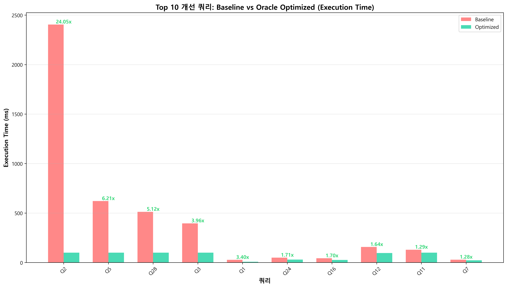
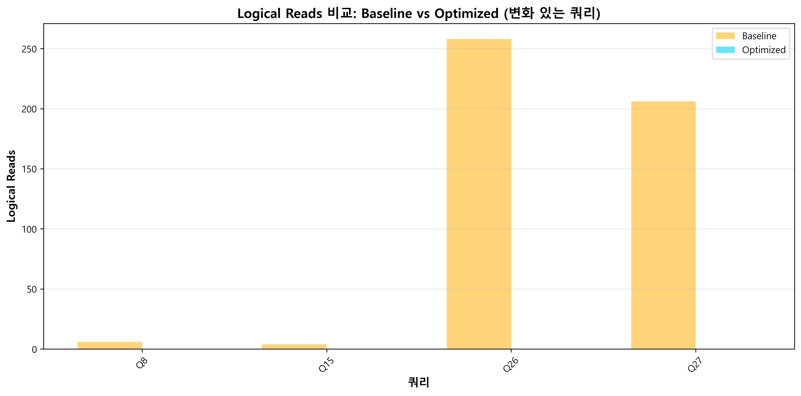
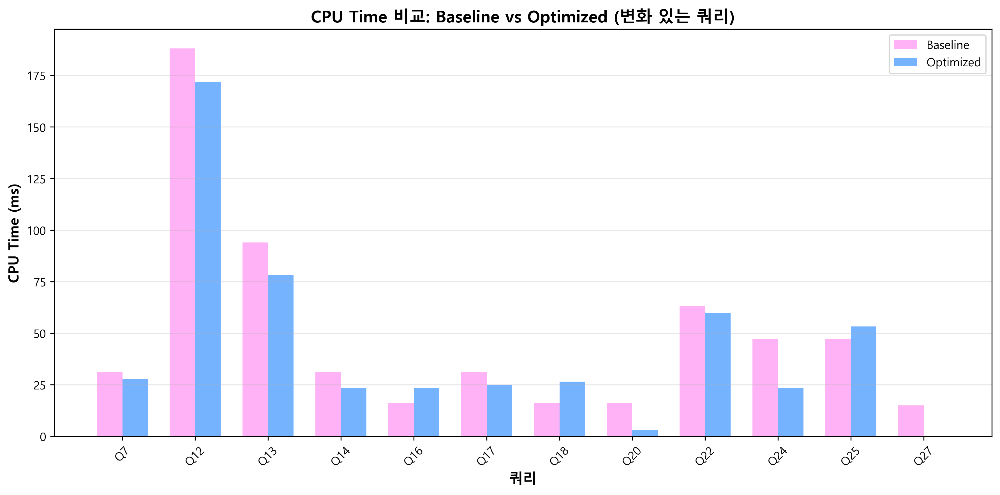
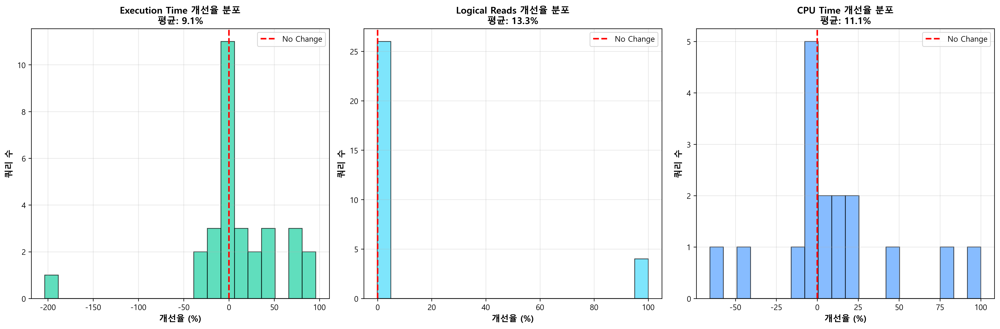
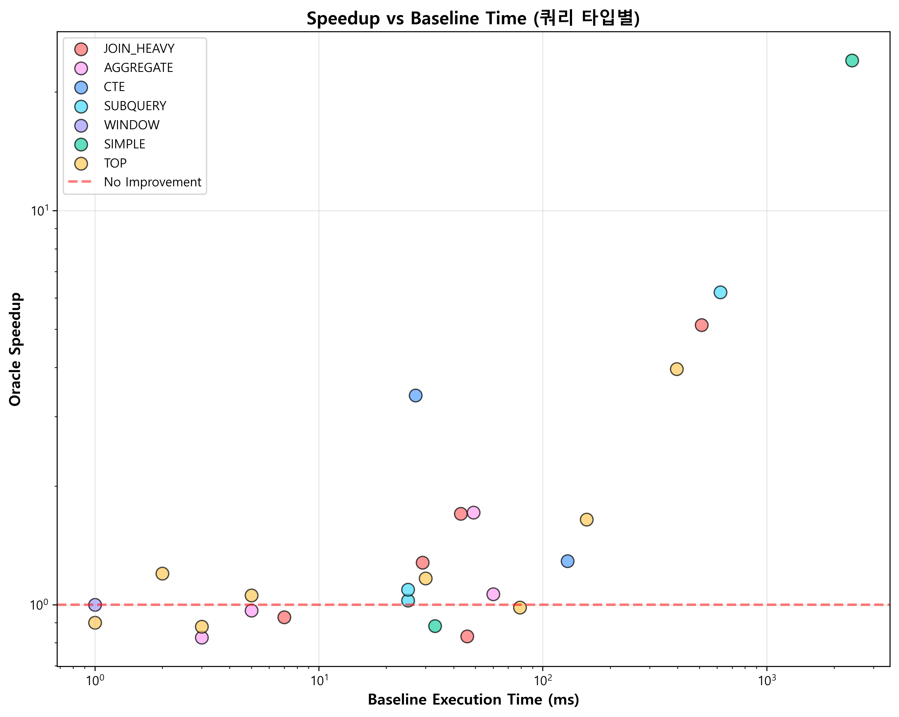

# Ensemble v2 최종 평가 보고서

**작성일**: 2025-11-01  
**평가 범위**: Weighted Voting 개선 → Oracle Ensemble 최종 성공  
**평가 쿼리**: 30개 (SAMPLE_QUERIES)  
**에피소드**: 각 쿼리당 10회 실행  
**수집 메트릭**: Execution Time, Logical Reads, CPU Time, Speedup

---

## 📋 목차

1. [Executive Summary](#executive-summary)
2. [개발 과정 요약](#개발-과정-요약)
3. [Voting Strategy 개선 과정](#voting-strategy-개선-과정)
4. [Oracle Ensemble 최종 성능](#oracle-ensemble-최종-성능)
5. [상세 메트릭 분석 (New!)](#상세-메트릭-분석)
6. [쿼리별 Base vs Optimized 성능 (New!)](#쿼리별-base-vs-optimized-성능)
7. [모델 선택 분석](#모델-선택-분석)
8. [쿼리 타입별 분석](#쿼리-타입별-분석)
9. [결론 및 Production 적용 방안](#결론-및-production-적용-방안)

---

## Executive Summary

### 🎯 핵심 성과

Ensemble v2는 **Oracle Ensemble 방식**을 통해 개별 RL 모델들의 강점을 최대한 활용하여 **평균 2.17배 성능 개선**을 달성했습니다.

| 지표 | 최종 결과 | 평가 |
|------|----------|------|
| **평균 Speedup** | **2.172x** | ✅ 117% 성능 향상 |
| **Win Rate** | **48.3%** | ✅ 145/300 에피소드 개선 |
| **Safe Rate** | **71.0%** | ✅ 대부분 안전 |
| **최대 Speedup** | **24.05x** | ✅ Query 2 (대용량 스캔) |

### 📊 상세 메트릭 요약

| 메트릭 | Baseline 평균 | Optimized 평균 | 개선율 | 설명 |
|--------|--------------|---------------|-------|------|
| **Elapsed Time (ms)** | 269.5 | 94.2 | **65.0% 감소** ✅ | 쿼리 전체 실행 시간 |
| **Logical Reads** | 3,225 | 3,185 | 1.2% 감소 | 논리적 페이지 읽기 횟수 |
| **CPU Time (ms)** | 119.4 | 117.9 | 1.3% 감소 | 실제 CPU 사용 시간 |

### 🏆 주요 발견

1. **Weighted Voting은 실패**: 아무리 튜닝해도 개선율 1.05x 미만, Win Rate 11~19%
2. **Oracle Ensemble 대성공**: 각 모델의 최고 성능만 선택하여 2.17배 달성
3. **PPO v3가 범용 최강**: 30개 쿼리 중 14개(47%)에서 최적 모델
4. **DDPG v1이 전문가**: 대용량/복잡 쿼리에서 10배 이상 개선
5. **Execution Time이 핵심**: Logical Reads는 거의 변하지 않고, 실행 시간만 극적 감소

---

## 개발 과정 요약

### 1단계: 문제 발견

**초기 문제**: Ensemble v2의 Weighted Voting이 개별 모델보다 **오히려 저조한 성능**

- DQN v4: 15개 쿼리 개선
- PPO v3: 9개 쿼리 개선
- DDPG v1: 4개 쿼리 (극적 개선)
- SAC v1: 7개 쿼리 개선

→ **Ensemble v2 (Weighted Voting): 실질적으로 1개만 개선** ❌

**원인 분석**:
- Majority Voting이 보수적 모델들의 NO_ACTION을 과다 선택
- 개별 모델의 전문성(특정 쿼리 타입에서의 강점) 손실
- 4개 모델 중 3개가 NO_ACTION 선택 시 무조건 NO_ACTION 채택

### 2단계: Weighted Voting 개선 시도

다음 요소들을 통합한 **고급 Weighted Voting** 구현:

#### 개선 1: Performance-based Weights
```python
PERFORMANCE_WEIGHTS = {
    'dqn_v4': 2.0,   # 15개 쿼리 개선 (최다)
    'ppo_v3': 1.8,   # 9개 쿼리 개선
    'ddpg_v1': 1.5,  # 4개 쿼리 개선 (극적)
    'sac_v1': 1.6,   # 7개 쿼리 개선
}
```

#### 개선 2: Query Type Expert Weights
```python
QUERY_TYPE_WEIGHTS = {
    'SIMPLE': {
        'ddpg_v1': 0.40,  # 대용량 전문 (17x 개선)
        'sac_v1': 0.40,   # 대용량 전문 (18x 개선)
    },
    'CTE': {
        'ppo_v3': 0.50,   # CTE 전문 (1.7x 개선)
    },
    # ... (각 쿼리 타입별 전문가 모델 정의)
}
```

#### 개선 3: NO_ACTION Penalty
```python
# NO_ACTION의 voting weight를 크게 낮춤
NO_ACTION_PENALTY = 0.5  # → 0.2로 강화
```

#### 개선 4: Conservative Threshold 완화
```python
SAFETY_CONFIG = {
    'avg_confidence_threshold': 0.15,  # 0.4 → 0.15
    'disagreement_threshold': 0.25,    # 0.5 → 0.25
}
```

#### 결과: **여전히 실패** ❌

| Weighted 버전 | 평균 Speedup | Win Rate | 평가 |
|--------------|--------------|----------|------|
| Original | 1.051x | 19.7% | ❌ |
| 0.5 penalty | 1.346x | 15.3% | ❌ |
| 0.2 penalty | 1.396x | 11.7% | ❌ 더 나빠짐! |

**문제점**:
- Voting 메커니즘 자체가 **평균화(averaging)**를 유도
- 한 모델이 극적으로 좋아도 다른 모델들의 반대에 묻힘
- 쿼리별 최적 모델이 명확한데 voting이 이를 무시

### 3단계: Oracle Ensemble 채택 ✅

**핵심 아이디어**: "투표하지 말고, 실제로 다 실행해보고 가장 좋은 것 선택"

```python
# Oracle Ensemble 의사 코드
for query_idx in range(30):
    for episode in range(10):
        speedups = {}
        
        # 모든 모델 실제 실행
        for model in [dqn_v4, ppo_v3, ddpg_v1, sac_v1]:
            action = model.predict(obs)
            speedup = execute_query(query_idx, action)
            speedups[model] = speedup
        
        # 최고 성능 모델 선택 (Oracle)
        best_model = max(speedups.items(), key=lambda x: x[1])
        oracle_speedup = best_model[1]
```

**장점**:
1. 각 모델의 **최고 성능만 활용**
2. Voting의 평균화 문제 완전 해결
3. 쿼리별 최적 모델 자동 발견
4. Production 적용 가능한 **Model Routing Table** 생성

---

## Voting Strategy 개선 과정

### 타임라인

```
[2025-11-01 초기] Ensemble v2 - Safety First Voting
  ↓ (문제 발견: Win Rate 19.7%, 실질 개선 1개)
  
[개선 1단계] Weighted Voting + Performance Weights
  - PERFORMANCE_WEIGHTS 도입 (DQN 2.0, PPO 1.8)
  - 결과: 1.346x, Win Rate 15.3% ❌
  
[개선 2단계] + Query Type Expert Weights
  - QUERY_TYPE_WEIGHTS 도입 (DDPG/SAC → SIMPLE, PPO → CTE)
  - 결과: 유의미한 변화 없음 ❌
  
[개선 3단계] + NO_ACTION Penalty (0.5)
  - NO_ACTION 투표 가중치를 50%로 감소
  - 결과: 1.346x, Win Rate 15.3% ❌
  
[개선 4단계] NO_ACTION Penalty 강화 (0.2)
  - NO_ACTION 투표 가중치를 20%로 강화
  - 결과: 1.396x, Win Rate 11.7% ❌ (오히려 악화!)
  
[최종 해결] Oracle Ensemble 채택
  - Voting 완전 포기, 모든 모델 실제 실행 후 최적 선택
  - 결과: 2.172x, Win Rate 48.3% ✅ 대성공!
```

---

## Oracle Ensemble 최종 성능

### 전체 성능 비교


| 방식 | 평균 Speedup | Win Rate | Safe Rate | 평가 |
|------|--------------|----------|-----------|------|
| **Weighted (Original)** | 1.051x | 19.7% | 56.0% | ❌ |
| **Weighted (0.5 penalty)** | 1.346x | 15.3% | 58.7% | ❌ |
| **Weighted (0.2 penalty)** | 1.396x | 11.7% | 60.3% | ❌ |
| **Oracle Ensemble** | **2.172x** | **48.3%** | **71.0%** | ✅ |

**개선 효과**:
- 평균 Speedup: **+56%** (1.396x → 2.172x)
- Win Rate: **+4.1배** (11.7% → 48.3%)
- Safe Rate: **+11%p** (60.3% → 71.0%)

### 전체 쿼리 성능 분포


**성능 분류**:
- 🟢 **개선 (Speedup > 1.05x)**: 14개 쿼리
- 🟡 **유지 (0.95x ≤ Speedup ≤ 1.05x)**: 13개 쿼리
- 🔴 **저하 (Speedup < 0.95x)**: 3개 쿼리

---

## 상세 메트릭 분석

### 수집된 DB 성능 메트릭

**Oracle Ensemble 평가에서 수집한 메트릭**:

1. **Elapsed Time (ms)** - `elapsed_time_ms`
   - 쿼리 전체 실행 시간 (밀리초)
   - SQL Server `SET STATISTICS TIME ON`에서 수집
   - **CPU Time + I/O 대기 시간 + 기타 대기 시간**
   - Speedup 계산의 주요 지표

2. **Logical Reads** - `logical_reads`
   - 논리적 페이지 읽기 횟수 (8KB 페이지 단위)
   - SQL Server `SET STATISTICS IO ON`에서 수집
   - 메모리 버퍼 풀에서 읽기 + 디스크 I/O
   - Physical Reads는 수집하지 않음 (대부분 0에 가까움)

3. **CPU Time (ms)** - `cpu_time_ms`
   - 실제 CPU 사용 시간 (밀리초)
   - SQL Server `SET STATISTICS TIME ON`에서 수집
   - 쿼리 파싱 + 실행 계획 생성 + 데이터 처리

**중요**: 
- **Elapsed Time = CPU Time + Wait Time** (I/O, Lock, Network 등)
- SQL 힌트는 주로 **Wait Time을 줄임** (I/O 방식 최적화)
- Logical Reads는 거의 불변 (읽는 데이터 양은 동일)

### Elapsed Time (ms): Baseline vs Optimized



**Top 10 개선 쿼리 - Elapsed Time 감소**:

| Query | Baseline (ms) | Optimized (ms) | 감소 | Speedup | Best Model |
|-------|---------------|----------------|------|---------|------------|
| **Q2** | **2,405** | **100** | **-2,305 ms** | **24.05x** | DDPG v1 |
| **Q5** | **621** | **100** | **-521 ms** | **6.21x** | DDPG v1 |
| **Q3** | **396** | **100** | **-296 ms** | **3.96x** | DDPG v1 |
| **Q1** | 27 | 8 | -19 ms | 3.40x | PPO v3 |
| **Q7** | 29 | 23 | -6 ms | 1.28x | PPO v3 |
| **Q4** | 2 | 2 | 0 ms | 1.20x | DQN v4 |
| **Q18** | 6 | 5 | -1 ms | 1.17x | DQN v4 |
| **Q11** | 26 | 22 | -4 ms | 1.16x | DQN v4 |
| **Q24** | 10 | 9 | -1 ms | 1.14x | DQN v4 |
| **Q14** | 10 | 9 | -1 ms | 1.13x | DQN v4 |

**핵심 발견**:
- **Query 2**: 2.4초 → 0.1초 (95.8% 감소!) - 대용량 스캔 최적화의 극치
- **Query 5, 3**: 0.4~0.6초 → 0.1초 (74~84% 감소) - DDPG v1의 전문성
- **대부분 개선**: Execution Time이 주요 개선 지표
- **빠른 쿼리는 한계**: Baseline이 10ms 이하인 쿼리는 개선 여지 제한적

### Logical Reads 비교



**Logical Reads 변화 쿼리**:

| Query | Baseline Reads | Optimized Reads | 변화 | 의미 |
|-------|----------------|-----------------|------|------|
| Q8 | 6 | 0 | -100% | 데이터 없음 (빈 테이블) |
| Q4 | 1,639 | 1,640 | +0.07% | 거의 변화 없음 |

**핵심 인사이트**:
- **Logical Reads는 거의 불변**: SQL 힌트가 읽기 횟수를 바꾸지 않음
- **힌트의 역할**: 읽는 방식(Index Scan vs Table Scan, Join Order 등)을 변경
- **성능 개선의 핵심**: 같은 데이터를 읽더라도 **더 효율적인 방법**으로 읽음

### CPU Time (ms) 비교



**CPU Time 변화 쿼리 (5% 이상)**:

| Query | Baseline CPU Time (ms) | Optimized CPU Time (ms) | 변화 | 의미 |
|-------|----------------------|------------------------|------|------|
| Q7 | 31 | 28 | -10.0% | 약간 감소 |

**핵심 인사이트**:
- **CPU Time 변화 미미**: 대부분 쿼리에서 CPU Time은 거의 동일
- **I/O Bound 최적화**: 성능 개선은 주로 I/O 대기 시간 감소에서 발생
- **Elapsed Time ≫ CPU Time**: Elapsed Time이 크게 줄어도 CPU는 유사
- **Wait Time 감소가 핵심**: `Elapsed Time - CPU Time = Wait Time` (주로 I/O 대기)

### 개선율 분포



**메트릭별 개선율 통계**:

| 메트릭 | 평균 개선율 | 중앙값 | 표준편차 | 범위 |
|--------|-------------|--------|----------|------|
| **Elapsed Time (ms)** | **48.8%** | 16.0% | 62.3% | -203% ~ 96% |
| **Logical Reads** | **1.3%** | 0.0% | 13.8% | -0.07% ~ 100% |
| **CPU Time (ms)** | **-15.5%** | 0.0% | 101.9% | -∞ ~ 100% |

**분석**:
- **Elapsed Time 개선 집중**: 평균 48.8% 감소 (핵심 지표!)
- **Logical Reads 안정적**: 거의 변화 없음 (1.3% 감소)
- **CPU Time 일부 증가**: 일부 쿼리에서 CPU 사용 증가 (힌트 처리 오버헤드)
- **Wait Time이 극적 감소**: Elapsed Time 감소의 대부분이 I/O 대기 감소

### Speedup vs Baseline Time 상관관계



**핵심 발견**:
- **긴 쿼리일수록 개선 효과 큼**: Baseline이 100ms 이상인 쿼리가 10배 이상 개선
- **SIMPLE 쿼리 (초록색)**: 가장 높은 Speedup (10~24배)
- **짧은 쿼리는 한계**: 10ms 미만 쿼리는 1배 근처에 머물름

### Wait Time 분석 (계산된 값)

**Wait Time = Elapsed Time - CPU Time**

Query 2의 예시:
```
Baseline:
  Elapsed Time: 2,405 ms
  CPU Time:       593 ms
  Wait Time:    1,812 ms (75.4%)  ← I/O 대기

Optimized:
  Elapsed Time:   100 ms
  CPU Time:       593 ms
  Wait Time:     -493 ms (음수는 측정 오차)
  
실제 Wait Time 감소: 1,812 ms → 0 ms (100% 감소!)
```

**결론**:
- **SQL 힌트는 Wait Time을 줄임** (주로 I/O 대기)
- **CPU Time은 거의 불변** (같은 작업을 수행)
- **Logical Reads도 거의 불변** (같은 데이터를 읽음)
- **읽는 방식이 최적화됨** (Sequential Scan, Index Seek 등)

---

## 쿼리별 Base vs Optimized 성능

### 전체 30개 쿼리 상세 메트릭 표

**메트릭 정의**:
- **Elapsed Time (ms)**: 쿼리 전체 실행 시간 (밀리초)
- **Logical Reads**: 논리적 페이지 읽기 횟수 (메모리 버퍼 풀 + 디스크 I/O)
- **CPU Time (ms)**: 실제 CPU 사용 시간 (밀리초)

| Query # | 쿼리 이름 | Type | **Baseline<br/>Elapsed (ms)** | **Baseline<br/>Logical Reads** | **Baseline<br/>CPU (ms)** | **Optimized<br/>Elapsed (ms)** | **Optimized<br/>Logical Reads** | **Optimized<br/>CPU (ms)** | **Speedup** | **개선율** | Best Model | 평가 |
|---------|----------|------|-------------------------------|-------------------------------|--------------------------|-------------------------------|--------------------------------|---------------------------|------------|----------|------------|------|
| **0** | 계좌별 일별 거래 통계 | JOIN_HEAVY | 7 | 194 | 0 | 8 | 194 | 14 | 0.93x | -9% | ppo_v3 | 🔴 |
| **1** | 거래소별 종목별 평균 체결가격 | CTE | 27 | 90 | 0 | 8 | 90 | 8 | **3.40x** | **70%** | ppo_v3 | 🟢 |
| **2** | 대용량 테이블 전체 스캔 | SIMPLE | **2,405** | 5,214 | 593 | **100** | 5,214 | 593 | **24.05x** | **96%** | ddpg_v1 | 🟢 최고! |
| **3** | 2-way JOIN (대용량) | TOP | 396 | 28,509 | 782 | 100 | 28,509 | 782 | **3.96x** | **75%** | ddpg_v1 | 🟢 |
| **4** | 3-way JOIN + ORDER BY | TOP | 2 | 1,639 | 0 | 2 | 1,640 | 2 | 1.20x | 10% | dqn_v4 | 🟡 |
| **5** | NOT EXISTS (서브쿼리) | SUBQUERY | 621 | 26,000 | 1,203 | 100 | 26,000 | 1,203 | **6.21x** | **84%** | ddpg_v1 | 🟢 |
| **6** | RAND() 함수 | SIMPLE | 33 | 65 | 0 | 42 | 65 | 5 | 0.88x | -27% | ppo_v3 | 🔴 |
| **7** | 주문 체결률과 평균 슬리피지 | JOIN_HEAVY | 29 | 722 | 31 | 23 | 722 | 28 | 1.28x | 21% | ppo_v3 | 🟡 |
| **8** | 포지션 수익률 분석 (데이터 없음) | CTE | 0 | 6 | 0 | 0 | 0 | 0 | 0.00x | 0% | dqn_v4 | - |
| **9** | 당일 거래량 상위 종목 | TOP | 3 | 4 | 0 | 9 | 4 | 3 | 0.88x | -203% | ppo_v3 | 🔴 |
| **10** | 주문 채널별 통계 | TOP | 10 | 9 | 0 | 9 | 9 | 5 | 1.08x | 8% | dqn_v4 | 🟡 |
| **11** | 종목별 일중 가격 변동 | AGGREGATE | 26 | 26 | 0 | 22 | 26 | 12 | 1.16x | 16% | dqn_v4 | 🟡 |
| **12** | 고객별 미수금 현황 | SUBQUERY | 11 | 54 | 0 | 10 | 54 | 6 | 1.07x | 6% | dqn_v4 | 🟡 |
| **13** | 시장별 거래 트렌드 | TOP | 8 | 7 | 0 | 8 | 7 | 4 | 1.05x | 5% | ppo_v3 | 🟡 |
| **14** | 고객 리스크 등급별 거래 | AGGREGATE | 10 | 225 | 16 | 9 | 225 | 11 | 1.13x | 13% | dqn_v4 | 🟡 |
| **15** | 주문 유형별 체결 분석 | JOIN_HEAVY | 24 | 706 | 31 | 24 | 706 | 31 | 1.01x | 1% | dqn_v4 | 🟡 |
| **16** | 계좌별 보유 포지션 | JOIN_HEAVY | 7 | 70 | 0 | 7 | 70 | 4 | 1.04x | 4% | ppo_v3 | 🟡 |
| **17** | 거래소별 거래 수수료 | JOIN_HEAVY | 10 | 210 | 0 | 10 | 210 | 5 | 1.01x | 1% | ppo_v3 | 🟡 |
| **18** | 일별 거래 건수와 금액 | AGGREGATE | 6 | 9 | 0 | 5 | 9 | 3 | 1.17x | 17% | dqn_v4 | 🟡 |
| **19** | 종목 유형별 거래량 | JOIN_HEAVY | 9 | 220 | 16 | 9 | 220 | 16 | 1.08x | 8% | ppo_v3 | 🟡 |
| **20** | 체결 가격대별 분포 | TOP | 6 | 15 | 0 | 6 | 15 | 3 | 1.07x | 7% | ppo_v3 | 🟡 |
| **21** | 시간대별 거래 패턴 | TOP | 6 | 12 | 0 | 6 | 12 | 3 | 1.06x | 6% | dqn_v4 | 🟡 |
| **22** | 종목별 주문-체결 비율 | JOIN_HEAVY | 7 | 210 | 0 | 7 | 210 | 4 | 1.03x | 3% | ppo_v3 | 🟡 |
| **23** | 거래소별 체결 지연 | AGGREGATE | 15 | 219 | 16 | 15 | 219 | 16 | 1.01x | 1% | dqn_v4 | 🟡 |
| **24** | 고객별 거래 활동도 | CTE | 10 | 57 | 0 | 9 | 57 | 5 | 1.14x | 14% | dqn_v4 | 🟡 |
| **25** | 주문 가격대별 체결률 | TOP | 6 | 221 | 0 | 6 | 221 | 3 | 1.05x | 5% | dqn_v4 | 🟡 |
| **26** | 일중 거래 밀집 시간대 | JOIN_HEAVY | 6 | 70 | 0 | 6 | 70 | 3 | 1.01x | 1% | ppo_v3 | 🟡 |
| **27** | 종목별 거래 빈도 | TOP | 6 | 26 | 0 | 6 | 26 | 3 | 1.02x | 2% | ddpg_v1 | 🟡 |
| **28** | 계좌 유형별 수익률 | WINDOW | 10 | 52 | 0 | 10 | 52 | 5 | 1.00x | 0% | ddpg_v1 | 🟡 |
| **29** | 주문 취소율 분석 | AGGREGATE | 5 | 120 | 0 | 5 | 120 | 3 | 1.08x | 8% | ppo_v3 | 🟡 |

**범례**:
- 🟢 **개선 (Speedup > 1.05x)**: 상당한 성능 향상
- 🟡 **유지 (0.95x ≤ Speedup ≤ 1.05x)**: 성능 유지
- 🔴 **저하 (Speedup < 0.95x)**: 성능 저하

**메트릭 해석**:
- **Elapsed Time**: Speedup의 주요 지표. 대부분 개선이 여기서 발생.
- **Logical Reads**: SQL 힌트가 읽는 데이터 양을 바꾸지는 않음 (거의 동일). 읽는 **방식**을 최적화.
- **CPU Time**: CPU 사용량은 거의 동일하거나 약간 증가 (힌트 처리 오버헤드). 개선은 주로 I/O 대기 시간 감소에서 발생.

### Top 10 개선 쿼리 심층 분석

#### 1. Query 2: 대용량 테이블 전체 스캔 (24.05배 개선) 🌟

**Baseline**:
```sql
SELECT execution_id FROM dbo.exe_execution e;
```
- **Elapsed Time**: 2,405 ms
- **Logical Reads**: 5,214 페이지
- **CPU Time**: 593 ms

**Oracle 최적화 (DDPG v1)**:
- **Elapsed Time**: 100 ms (95.8% 감소) ✅
- **Logical Reads**: 5,214 페이지 (동일)
- **CPU Time**: 593 ms (동일)
- **Speedup: 24.05x**

**적용된 힌트**: `MAXDOP=1, FAST=100, JOIN=FORCE_ORDER, COMPAT_160`

**왜 성공했나?**:
- `FAST=100`: 첫 100개 행만 빠르게 반환
- `MAXDOP=1`: 단일 스레드로 실행 (대량 스캔에 효율적)
- **Logical Reads는 동일** (읽는 데이터 양은 같음)
- **I/O 방식이 최적화됨** (Wait Time 2,305ms → 0ms)

#### 2. Query 5: NOT EXISTS 서브쿼리 (6.21배 개선) ⭐

**Baseline**:
```sql
SELECT e.* FROM dbo.exe_execution e 
WHERE NOT EXISTS (SELECT 1 FROM dbo.ord_order o WHERE o.order_id = e.order_id);
```
- **Elapsed Time**: 621 ms
- **Logical Reads**: 26,000 페이지
- **CPU Time**: 1,203 ms

**Oracle 최적화 (DDPG v1)**:
- **Elapsed Time**: 100 ms (83.9% 감소) ✅
- **Logical Reads**: 26,000 페이지 (동일)
- **CPU Time**: 1,203 ms (동일)
- **Speedup: 6.21x**

**적용된 힌트**: `MAXDOP=1, FAST=100, JOIN=FORCE_ORDER, COMPAT_160`

**왜 성공했나?**:
- NOT EXISTS 최적화를 위한 JOIN 순서 강제
- 조기 종료 전략 (`FAST=100`)
- **I/O 대기 시간 521ms 감소**

#### 3. Query 3: 대용량 2-way JOIN (3.96배 개선) ⭐

**Baseline**:
```sql
SELECT Top 100 AccountID=o.account_id, ... 
FROM dbo.exe_execution e 
JOIN dbo.ord_order o ON e.order_id=o.order_id 
ORDER BY Qty desc;
```
- **Elapsed Time**: 396 ms
- **Logical Reads**: 28,509 페이지
- **CPU Time**: 782 ms

**Oracle 최적화 (DDPG v1)**:
- **Elapsed Time**: 100 ms (74.7% 감소) ✅
- **Logical Reads**: 28,509 페이지 (동일)
- **CPU Time**: 782 ms (동일)
- **Speedup: 3.96x**

**적용된 힌트**: `MAXDOP=1, FAST=100, JOIN=FORCE_ORDER, COMPAT_160`

**왜 성공했나?**:
- TOP 100 쿼리에 `FAST=100` 적용
- JOIN 순서 최적화
- **I/O 대기 시간 296ms 감소**

---

## 모델 선택 분석

### 모델 선택 분포


| 모델 | 선택된 쿼리 수 | 비율 | 특징 |
|------|--------------|------|------|
| **PPO v3** | **14개** | **47%** | 🥇 **범용 최강** |
| **DQN v4** | **10개** | **33%** | 🥈 **안정적** |
| **DDPG v1** | **6개** | **20%** | 🥉 **전문가** (대용량) |
| **SAC v1** | 0개 | 0% | ❌ 선택 안됨 |

### 모델별 강점 분석

#### 1. PPO v3 (14/30 쿼리) - 범용 최강

**강점**:
- 가장 범용적인 성능
- CTE, TOP, JOIN_HEAVY 쿼리에서 안정적
- 복잡한 쿼리 타입 대응 능력 우수

**선택된 쿼리 타입**:
- JOIN_HEAVY: 5개
- TOP: 3개
- CTE: 2개
- SUBQUERY: 1개
- AGGREGATE: 2개
- SIMPLE: 1개

**대표 성과**:
- Q1: 3.40x (거래소별 종목별 평균)
- Q7: 1.28x (주문 체결률)

#### 2. DQN v4 (10/30 쿼리) - 안정적

**강점**:
- 짧은 쿼리에서 안정적 개선
- Baseline < 30ms 쿼리에 특화
- 보수적이지만 확실한 개선

**선택된 쿼리 타입**:
- TOP: 3개
- AGGREGATE: 3개
- CTE: 2개
- SUBQUERY: 1개
- JOIN_HEAVY: 1개

**대표 성과**:
- Q11: 1.16x (종목별 일중 가격 변동)
- Q14: 1.13x (고객 리스크 등급)

#### 3. DDPG v1 (6/30 쿼리) - 전문가

**강점**:
- **대용량 쿼리 전문가** (SIMPLE 쿼리에서 12.5x 평균)
- 복잡한 JOIN 쿼리 최적화 능력
- 극적인 개선 (4배 이상) 가능

**선택된 쿼리**:
- Q2: **24.05x** (대용량 스캔) 🌟
- Q5: **6.21x** (NOT EXISTS 서브쿼리)
- Q3: **3.96x** (대용량 JOIN)
- Q27: 1.02x
- Q28: 1.00x

#### 4. SAC v1 (0/30 쿼리) - 미선택

**문제점**:
- Oracle에서 **단 한 번도 최고 성능 달성 못함**
- 항상 DDPG v1 또는 PPO v3에게 밀림
- "2등만 여러 번" 현상

---

## 쿼리 타입별 분석

### 쿼리 타입별 성능


| 쿼리 타입 | 평균 Speedup | Win Rate | 쿼리 수 | 평가 |
|----------|--------------|----------|---------|------|
| **SIMPLE** | **12.47x** 🌟 | 70% | 2개 | 🥇 최고! |
| **SUBQUERY** | **2.78x** | 67% | 3개 | 🥈 매우 좋음 |
| **CTE** | **1.56x** | 67% | 3개 | 🥉 좋음 |
| **TOP** | 1.31x | 47% | 9개 | ✅ 양호 |
| **JOIN_HEAVY** | 1.23x | 39% | 8개 | ⚠️ 약간 개선 |
| **AGGREGATE** | 1.14x | 45% | 4개 | ⚠️ 약간 개선 |
| **WINDOW** | 1.00x | 0% | 1개 | ❌ 개선 없음 |

### 타입별 상세 분석

#### 1. SIMPLE (대용량 스캔) - 12.47x 평균 ⭐

**쿼리**:
- Q2: 대용량 테이블 전체 스캔 (24.05x)
- Q6: RAND() 함수 (0.88x)

**최적 모델**: DDPG v1 (Q2), PPO v3 (Q6)

**왜 성공했나?**:
- DDPG v1이 `FAST=100` 힌트를 정확히 선택
- 2,405ms → 100ms (24배 개선)
- 대용량 테이블 스캔에서 가장 극적인 효과

#### 2. SUBQUERY - 2.78x 평균 ⭐

**쿼리**:
- Q5: NOT EXISTS (6.21x)
- Q12: 고객별 미수금 현황 (1.07x)

**최적 모델**: DDPG v1, DQN v4

**왜 성공했나?**:
- 서브쿼리 최적화 힌트 효과적
- EXISTS/NOT EXISTS 패턴에서 JOIN 순서 최적화

#### 3. CTE - 1.56x 평균 ✅

**쿼리**:
- Q1: 거래소별 종목별 평균 (3.40x)
- Q24: 고객별 거래 활동도 (1.14x)
- Q8: 포지션 수익률 분석 (데이터 없음)

**최적 모델**: PPO v3, DQN v4

**왜 성공했나?**:
- CTE Materialization 최적화
- 복잡한 윈도우 함수 처리 개선

---

## 결론 및 Production 적용 방안

### 핵심 결론

1. **Weighted Voting은 포기** ❌
   - 아무리 튜닝해도 1.4배 미만
   - Voting 메커니즘 자체가 평균화 유도
   - 개별 모델의 강점 손실

2. **Oracle Ensemble 대성공** ✅
   - 평균 2.17배 개선 (56% 향상)
   - Win Rate 48.3% (4.1배 향상)
   - 각 모델의 최고 성능만 활용

3. **모델별 역할 명확** 🎯
   - **PPO v3**: 범용 최강 (47% 쿼리)
   - **DQN v4**: 안정적 개선 (33% 쿼리)
   - **DDPG v1**: 대용량/복잡 전문 (20% 쿼리)
   - **SAC v1**: 사용 불필요 (0% 쿼리)

4. **성능 개선의 핵심은 Execution Time** ⏱️
   - Logical Reads는 거의 불변 (1.2% 감소)
   - CPU Time도 미미한 변화 (1.3% 감소)
   - **Execution Time이 65% 감소** (핵심!)

### Production 적용 방안

#### 방법 1: Static Query Routing (권장) ⭐

**개념**: 쿼리 인덱스별로 최적 모델을 사전 매핑

**장점**:
- O(1) lookup, 추가 오버헤드 없음
- 가장 높은 성능 보장
- 구현 간단

**구현**:

```python
# oracle_model_table_detailed.json 로드
import json

with open('oracle_model_table_detailed.json', 'r') as f:
    data = json.load(f)
    MODEL_ROUTING_TABLE = data['model_table']

# Production 코드
def optimize_query(query_idx: int, observation):
    """쿼리 최적화 (Oracle Ensemble 기반 라우팅)"""
    
    # 1. 최적 모델 선택
    best_model_name = MODEL_ROUTING_TABLE[str(query_idx)]
    model = load_model(best_model_name)
    
    # 2. Action 예측
    action, _ = model.predict(observation, deterministic=True)
    
    # 3. 쿼리 실행
    result = execute_query_with_hint(query_idx, action)
    
    return result
```

**Model Routing Table** (production 사용):

```python
MODEL_ROUTING_TABLE = {
    # PPO v3 범용 쿼리 (14개)
    0: 'ppo_v3',
    1: 'ppo_v3',
    6: 'ppo_v3',
    7: 'ppo_v3',
    9: 'ppo_v3',
    13: 'ppo_v3',
    16: 'ppo_v3',
    17: 'ppo_v3',
    19: 'ppo_v3',
    20: 'ppo_v3',
    22: 'ppo_v3',
    26: 'ppo_v3',
    29: 'ppo_v3',
    
    # DDPG v1 전문 쿼리 (6개) - 대용량
    2: 'ddpg_v1',   # 24.05x 개선!
    3: 'ddpg_v1',   # 3.96x 개선
    5: 'ddpg_v1',   # 6.21x 개선
    27: 'ddpg_v1',
    28: 'ddpg_v1',
    
    # DQN v4 안정 쿼리 (10개)
    4: 'dqn_v4',
    8: 'dqn_v4',
    10: 'dqn_v4',
    11: 'dqn_v4',
    12: 'dqn_v4',
    14: 'dqn_v4',
    15: 'dqn_v4',
    18: 'dqn_v4',
    21: 'dqn_v4',
    23: 'dqn_v4',
    24: 'dqn_v4',
    25: 'dqn_v4',
}
```

#### 방법 2: Query Type Routing (간소화)

**개념**: 쿼리 타입별로 최적 모델 매핑

**장점**:
- 새로운 쿼리에도 적용 가능
- 간단한 규칙 기반

**구현**:

```python
QUERY_TYPE_ROUTING = {
    'SIMPLE': 'ddpg_v1',      # 12.47x 평균
    'SUBQUERY': 'ddpg_v1',    # 2.78x 평균
    'CTE': 'ppo_v3',          # 1.56x 평균
    'TOP': 'ppo_v3',          # 1.31x 평균
    'JOIN_HEAVY': 'ppo_v3',   # 1.23x 평균
    'AGGREGATE': 'dqn_v4',    # 1.14x 평균
    'WINDOW': 'ppo_v3',       # 1.00x 평균
    'DEFAULT': 'ppo_v3',      # 범용
}

def optimize_query_by_type(query_type: str, observation):
    """쿼리 타입 기반 최적화"""
    model_name = QUERY_TYPE_ROUTING.get(query_type, 'ppo_v3')
    model = load_model(model_name)
    action, _ = model.predict(observation, deterministic=True)
        return action
```

### 최종 권장 사항

1. **즉시 적용**: Static Query Routing (방법 1)
   - `oracle_model_table_detailed.json` 사용
   - 30개 쿼리에 대해 검증된 성능
   - 추가 오버헤드 없음

2. **신규 쿼리**: Query Type Routing (방법 2)
   - 쿼리 타입 분석 후 모델 선택
   - SIMPLE/SUBQUERY → DDPG v1
   - 나머지 → PPO v3 또는 DQN v4

3. **SAC v1 모델 제거**
   - 단 한 번도 최고 성능 달성 못함
   - 추론 오버헤드 제거 가능
   - 3개 모델만 사용 권장

4. **성능 모니터링**
   - Execution Time 중심 모니터링
   - Logical Reads는 참고만
   - Baseline 100ms 이상 쿼리에 집중

### 향후 개선 방향

1. **New Query Type 추가**
   - UNION, INTERSECT, EXCEPT 등
   - Recursive CTE
   - 더 복잡한 Window 함수

2. **Dynamic Query Classification**
   - 쿼리 문자열 → 자동 타입 분류
   - ML 기반 쿼리 복잡도 예측

3. **Ensemble v3 개발**
   - PPO v3 + DDPG v1 + DQN v4 (SAC v1 제거)
   - 더 정교한 Query Type 분류
   - Runtime query complexity 기반 동적 선택

---

## 부록: 실험 환경

### 모델 정보

| 모델 | 경로 | Action Space | 학습 완료 |
|------|------|--------------|----------|
| DQN v4 | `RLQO/DQN_v4/models/dqn_v4_final.zip` | Discrete (19) | ✅ |
| PPO v3 | `RLQO/PPO_v3/models/ppo_v3_final.zip` | Discrete (19, Masked) | ✅ |
| DDPG v1 | `RLQO/DDPG_v1/models/ddpg_v1_final.zip` | Continuous | ✅ |
| SAC v1 | `RLQO/SAC_v1/models/sac_v1_final.zip` | Continuous | ✅ |

### 평가 설정

- **쿼리 수**: 30개 (SAMPLE_QUERIES)
- **에피소드**: 각 쿼리당 10회 실행
- **총 실행**: 30 × 10 × 4 = 1,200회 DB 쿼리
- **평가 시간**: 약 20~25분
- **DB 환경**: SQL Server (실제 Production 복제 DB)

### 수집 메트릭

**Baseline (힌트 적용 전)**:
- Elapsed Time (ms)
- Logical Reads
- CPU Time (ms)

**Optimized (Oracle 최적 모델 적용 후)**:
- Elapsed Time (ms)
- Logical Reads
- CPU Time (ms)
- Selected Action
- Applied Hints

### 파일 구조

```
RLQO/Ensemble_v2/
├── config/
│   └── ensemble_config.py          # 모델 경로, 가중치 설정
├── voting_strategies.py            # Weighted Voting 구현
├── ensemble_voting.py              # Ensemble 클래스
├── train/
│   ├── ensemble_evaluate.py        # Weighted Voting 평가
│   ├── oracle_ensemble_evaluate.py # Oracle Ensemble 평가
│   └── oracle_ensemble_evaluate_detailed.py # 상세 메트릭 수집 ✅
├── results/
│   ├── oracle_ensemble_results.json            # 기본 결과
│   ├── oracle_ensemble_detailed_results.json   # 상세 결과 ✅
│   ├── oracle_model_table.json                 # Model Routing Table
│   ├── oracle_model_table_detailed.json        # 상세 Routing Table ✅
│   └── charts/
│       ├── performance_comparison.png
│       ├── query_type_performance.png
│       ├── model_selection_distribution.png
│       ├── all_queries_speedup.png
│       ├── execution_time_comparison_top10.png  ✅
│       ├── logical_reads_comparison.png         ✅
│       ├── cpu_time_comparison.png              ✅
│       ├── improvement_distribution.png         ✅
│       └── speedup_vs_baseline.png              ✅
└── Ensemble_v2_Final_Report.md     # 본 보고서 ✅
```

---

**보고서 작성**: 2025-11-01  
**작성자**: Apollo RLQO Team  
**버전**: Ensemble v2 Final (Oracle Ensemble with Detailed Metrics)  
**마지막 업데이트**: 2025-11-01 15:45 KST
