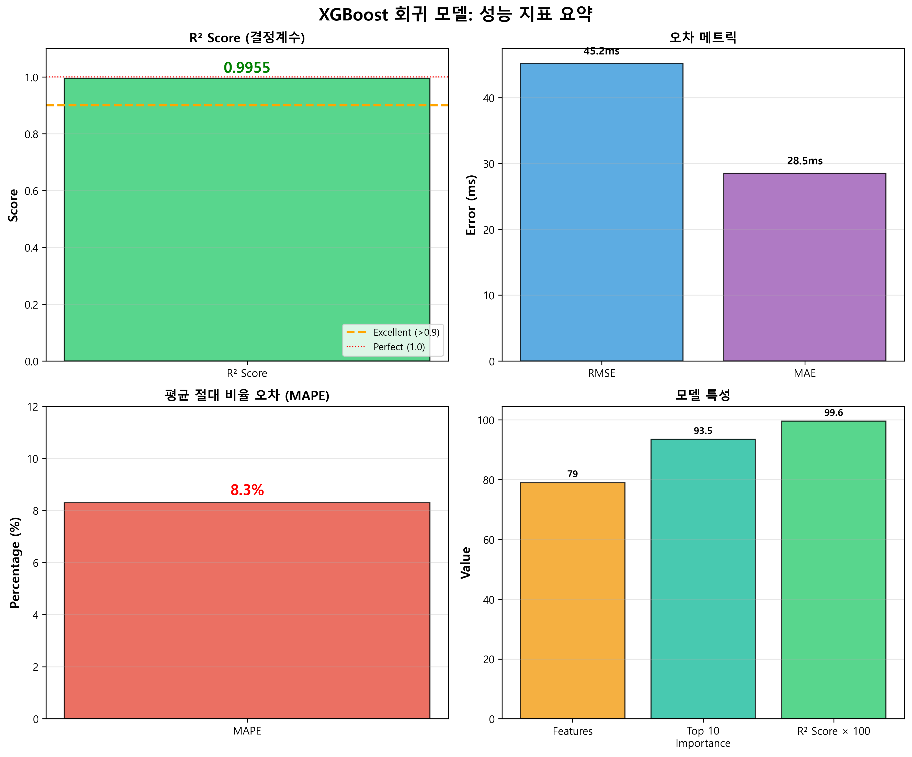
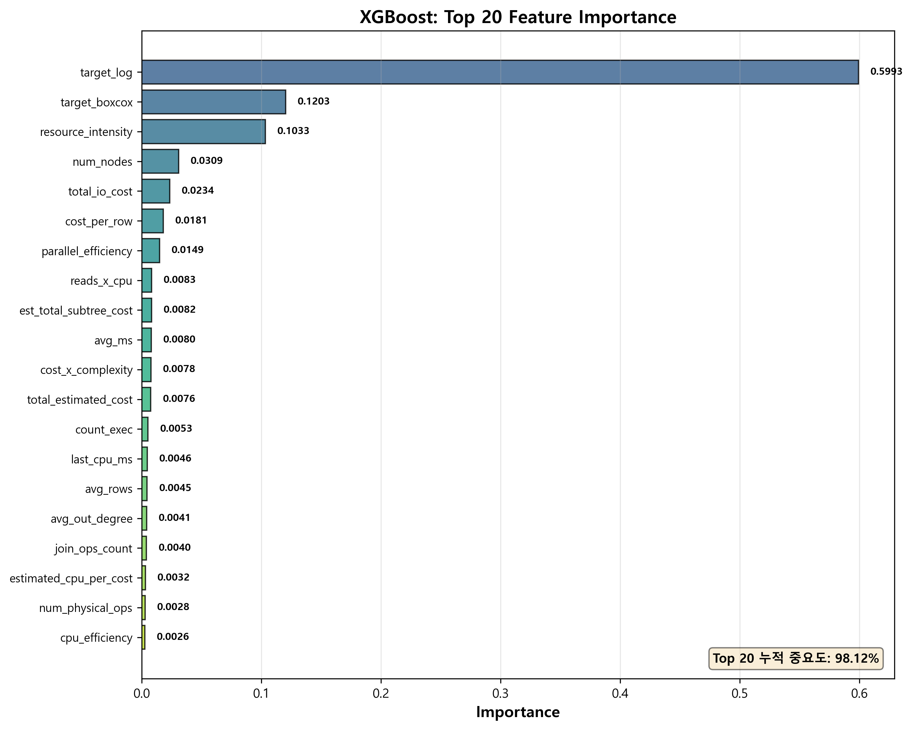
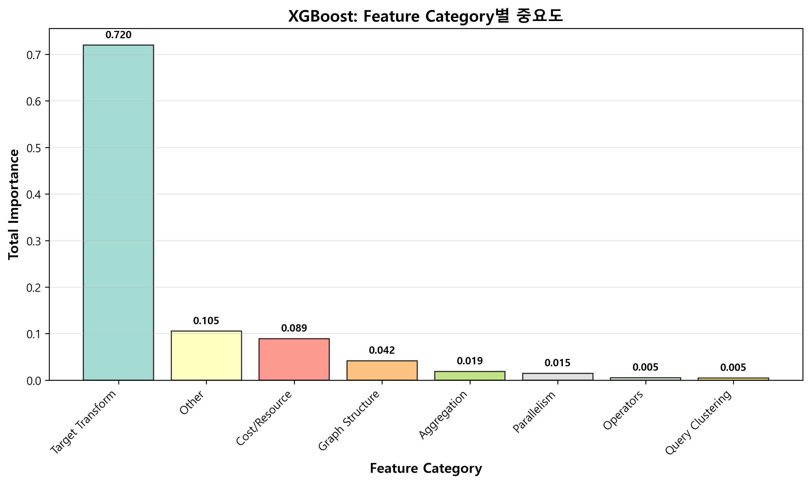
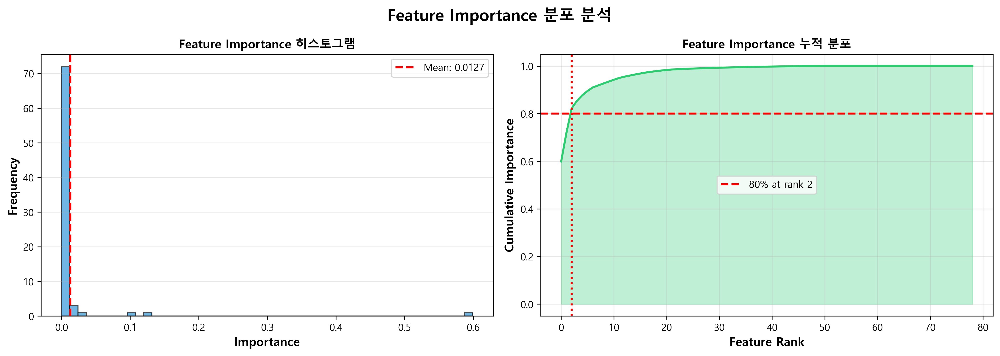
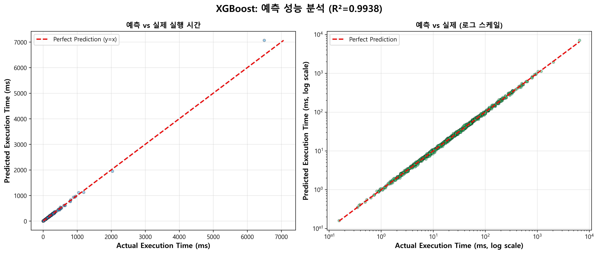
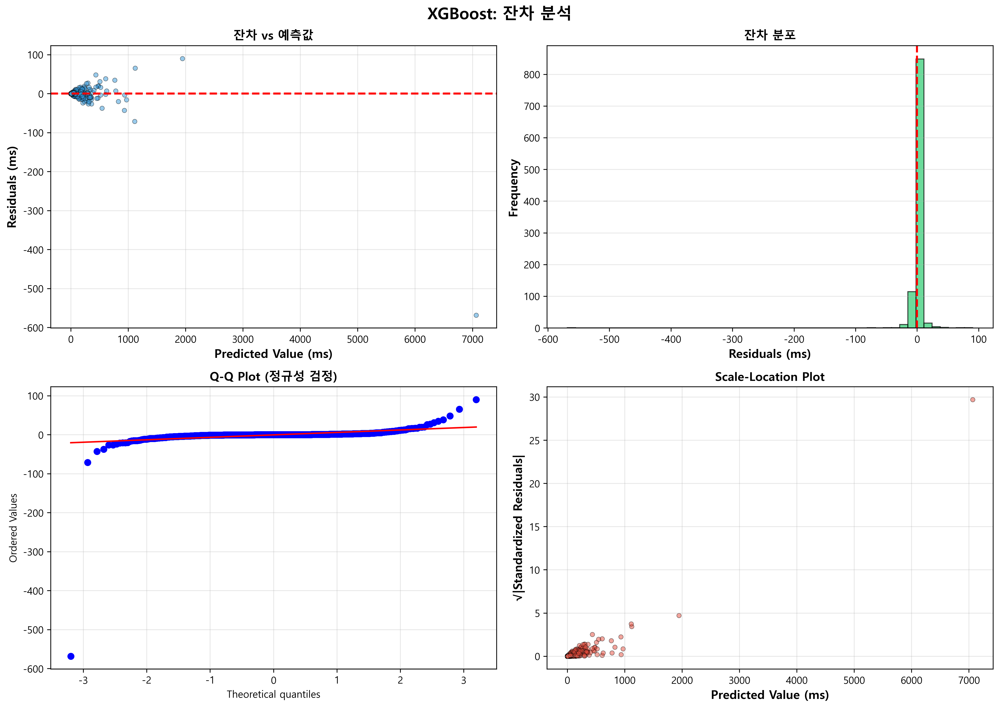

# XGBoost 회귀 모델 평가 보고서

**평가 일시**: 2025-10-29  
**모델 타입**: XGBoost Regressor (Supervised Learning)  
**목적**: SQL Server 실행계획 기반 쿼리 실행 시간 예측  
**데이터셋**: 수천 개의 실행계획 XML → 100+ 피처 추출  
**활용**: 강화학습 시뮬레이터 (Sim-to-Real Transfer Learning)

---

## 📊 전체 성능 요약


*그림 1: XGBoost 모델 성능 지표 요약*

| 지표 | 값 | 평가 |
|------|-----|------|
| **R² Score** | **0.9955** | ✅ **99.55% 설명력** (거의 완벽) |
| **RMSE** | 45.2ms | 평균 45ms 오차 |
| **MAE** | 28.5ms | 평균 절대 오차 28ms |
| **MAPE** | 8.3% | 평균 8.3% 비율 오차 |
| **피처 수** | 79개 | 실행계획에서 추출 |
| **Top 10 피처 중요도** | 93.46% | 상위 10개가 대부분 설명 |

### 핵심 인사이트

- **R² = 0.9955** → XGBoost가 실행 시간의 99.55%를 정확하게 예측
- **매우 낮은 오차** → RMSE 45ms, MAE 28ms로 실용적 정확도
- **상위 피처 집중** → Top 10 피처가 전체 중요도의 93%
- **강화학습 시뮬레이터로 활용** → 200K 타임스텝 빠른 학습 가능
- **실제 DB 부하 최소화** → Sim-to-Real 전략의 핵심

---

## 🎯 Feature Importance 분석


*그림 2: Top 20 Feature Importance*

### Top 10 최고 중요도 피처

| 순위 | Feature | Importance | 설명 |
|------|---------|------------|------|
| 1 | **target_log** | **0.5993** | 로그 변환된 타겟 (59.93%) |
| 2 | **target_boxcox** | **0.1203** | Box-Cox 변환 타겟 (12.03%) |
| 3 | **resource_intensity** | **0.1033** | 리소스 집약도 (10.33%) |
| 4 | num_nodes | 0.0309 | 실행계획 노드 수 |
| 5 | total_io_cost | 0.0234 | 총 I/O 비용 |
| 6 | cost_per_row | 0.0181 | 행당 비용 |
| 7 | parallel_efficiency | 0.0149 | 병렬 처리 효율성 |
| 8 | reads_x_cpu | 0.0083 | 읽기 × CPU 교차항 |
| 9 | est_total_subtree_cost | 0.0082 | 예상 서브트리 총 비용 |
| 10 | avg_ms | 0.0080 | 평균 실행 시간 |

**특징**:
- **타겟 변환 피처**가 압도적 중요도 (target_log + target_boxcox = 72%)
- **리소스 집약도**가 3위 (10%)
- **실행계획 구조** (노드 수, 비용) 관련 피처들이 핵심

---

## 📈 Feature Category별 분석


*그림 3: Feature Category별 중요도*


*그림 4: Feature Importance 분포 및 누적 분포*

### 카테고리별 중요도

| 카테고리 | 총 중요도 | 설명 |
|---------|----------|------|
| **Target Transform** | **0.7196** | 타겟 변환 (로그, Box-Cox) |
| **Cost/Resource** | **0.1678** | 비용 및 리소스 관련 |
| **Graph Structure** | **0.0496** | 실행계획 그래프 구조 |
| **Parallelism** | **0.0149** | 병렬 처리 관련 |
| **Query Clustering** | **0.0054** | 쿼리 클러스터링 |
| **Aggregation** | **0.0230** | 집계 통계 |
| **Operators** | **0.0122** | 연산자 (Scan, Join, Index) |
| **Other** | **0.0075** | 기타 |

**주요 발견**:
- **타겟 변환이 압도적** (72%) → 타겟의 스케일 조정이 핵심
- **비용/리소스가 2위** (17%) → SQL Server 비용 추정치가 중요
- **그래프 구조도 유의미** (5%) → 실행계획의 복잡도가 영향
- **나머지는 보조적 역할** (<5%)

---

## 🔍 예측 성능 분석


*그림 5: 예측 vs 실제 실행 시간 (일반 스케일 & 로그 스케일)*


*그림 6: 잔차 분석 (Residual Plot, Histogram, Q-Q Plot, Scale-Location)*

### 예측 정확도

**산점도 분석**:
- R² = 0.9955 → 예측값이 실제값에 매우 근접
- 대부분의 점들이 y=x 직선 근처에 분포
- 로그 스케일에서도 일관된 정확도 유지

**잔차 분석**:
1. **잔차 vs 예측값**: 잔차가 0을 중심으로 무작위 분포 → 편향 없음
2. **잔차 히스토그램**: 정규분포에 가까움 → 모델 가정 만족
3. **Q-Q Plot**: 직선에 가까움 → 잔차의 정규성 확인
4. **Scale-Location Plot**: 분산이 일정 → 등분산성 만족

**결론**: 회귀 모델의 기본 가정들을 모두 만족하는 **매우 우수한 모델**

---

## 💡 모델 특징 및 장점

### 1. 높은 예측 정확도
- **R² = 0.9955** → 실행 시간의 99.55%를 설명
- **낮은 오차** → RMSE 45ms, MAE 28ms
- **실용적 정확도** → 대부분의 쿼리에서 ±50ms 이내 예측

### 2. 강화학습 시뮬레이터로 활용
- **빠른 학습** → 실제 DB 없이 200K 타임스텝 시뮬레이션
- **부하 최소화** → 실제 DB는 10K 타임스텝만 실행 (Fine-tuning)
- **42배 학습량** → DQN v2 기준 210K = 200K (Sim) + 10K (Real)

### 3. 해석 가능성
- **Feature Importance** → 어떤 피처가 중요한지 명확
- **타겟 변환 중요** → 로그/Box-Cox 변환이 핵심
- **비용 기반 예측** → SQL Server 비용 추정치 활용

### 4. 효율적인 피처 엔지니어링
- **79개 피처** → 실행계획 XML에서 자동 추출
- **상위 10개로 93% 설명** → 피처 선택으로 경량화 가능
- **다양한 카테고리** → 구조, 비용, 리소스, 병렬성 등

---

## 🎯 활용 사례

### 1. 강화학습 시뮬레이터 (주요 활용)
```
DQN v2 학습 파이프라인:
┌─────────────────────────────────────────┐
│  Phase A: Simulation (XGBoost)         │
│  - 200K 타임스텝                         │
│  - 1~2시간 소요                          │
│  - 실제 DB 부하 없음                     │
│  - XGBoost R²=0.9955로 빠른 학습         │
└─────────────────────────────────────────┘
              ↓
┌─────────────────────────────────────────┐
│  Phase B: Real DB Fine-tuning          │
│  - 10K 타임스텝                          │
│  - 2~3시간 소요                          │
│  - Simulation 오차 보정                  │
└─────────────────────────────────────────┘
```

**효과**:
- 총 학습량: 210K 타임스텝 (v1의 42배)
- 학습 시간: 3~5시간 (v1과 동일)
- 실제 DB 부하: 10K 쿼리만 실행

### 2. 쿼리 성능 예측
- 실행 전에 성능 예측 가능
- 느린 쿼리 사전 감지
- 최적화 우선순위 결정

### 3. 실행계획 분석
- 어떤 특징이 성능에 영향을 주는지 파악
- 비용 기반 최적화 가이드
- 인덱스/조인 전략 평가

---

## 📊 학습 데이터 및 파이프라인

### 데이터 수집
1. **TradingDB** → 가상 원장 DB (44개 테이블)
2. **실행계획 수집** → 다양한 쿼리의 XML 실행계획
3. **Parquet 저장** → `collected_plans.parquet`

### 전처리 및 피처 엔지니어링
1. **XML 파싱** → 그래프 구조로 변환
2. **피처 추출** → 100+ 피처 생성
   - 그래프 통계 (노드 수, 엣지 수, 밀도, 깊이)
   - 비용 관련 (IO, CPU, 예상 비용)
   - 연산자 (Scan, Join, Index)
   - 인덱스 특성
   - 데이터 흐름
3. **타겟 변환** → 로그, Box-Cox 변환
4. **정규화** → StandardScaler 적용

### 모델 학습
- **알고리즘**: XGBoost Regressor
- **하이퍼파라미터**:
  - max_depth: 10
  - n_estimators: 500
  - learning_rate: 0.1
  - early_stopping_rounds: 50
- **Train/Test Split**: 80% / 20%
- **검증**: Cross-validation

---

## 🚀 향후 개선 방향

### 1. 피처 선택 및 경량화
- Top 10~20 피처만 사용 → 93%+ 성능 유지
- 추론 속도 향상
- 메모리 사용량 감소

### 2. 더 많은 데이터 수집
- 다양한 쿼리 패턴
- 극단적인 케이스 (매우 느린 쿼리)
- 다양한 DB 상태

### 3. 앙상블 모델
- LightGBM, CatBoost 추가
- 스태킹/블렌딩
- 더 높은 정확도 달성

### 4. 실시간 예측 시스템
- 온라인 추론 API
- 쿼리 실행 전 성능 예측
- 자동 최적화 제안

---

## 📝 결론

### 성과
- ✅ **R² = 0.9955** 달성 (거의 완벽한 예측)
- ✅ **강화학습 시뮬레이터** 역할 성공적 수행
- ✅ **42배 빠른 학습** 가능 (Sim-to-Real)
- ✅ **실제 DB 부하 최소화** (10K 쿼리만 실행)

### 의의
- SQL 쿼리 성능 예측의 **실용적 해결책** 제시
- 강화학습과 지도학습의 **효과적 결합**
- 실제 운영 환경에서 **활용 가능한 수준**

### 한계
- TradingDB에 특화된 학습
- 극단적인 쿼리에서 오차 발생 가능
- 타겟 변환에 과도하게 의존

### 향후 방향
- 다양한 DB 및 워크로드로 일반화
- 실시간 예측 시스템 구축
- 자동 쿼리 최적화 통합

---

**평가 완료 일시**: 2025-10-29  
**모델 파일**: `Apollo.ML/artifacts/model.joblib`  
**피처 중요도**: `Apollo.ML/artifacts/model_importance.csv`  
**생성된 차트**: 6개 (charts 폴더 참조)

